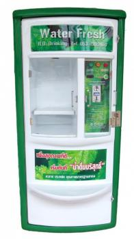

# แบบรายงานการทดลองครั้งที่ 2

## ตัวอย่าง

**สถานการณ์ที่ 1** : นายไก่อยากกินไข่เจียว เขามีอุปกรณ์เตรียมพร้อมทำไข่เจียวครบทุกอย่าง

**จงเขียนอัลกอริทึมและผังงานการทำไข่เจียว**

**ข้อมูลเข้า** : _ไข่ไก่_

**ข้อมูลออก** : _ไข่เจียว_

**อัลกอริทึม ของการทอดไข่เจียว**

1.  หยิบไข่ไก่
2.  ตอกไข่ไก่ใส่ภาชนะ
3.  ปรุงรสด้วยเครื่องปรุง
4.  ตีไข่ด้วยช้อนส้อม
5.  ตั้งกระทะบนเตา
6.  เปิดแก๊ส และติดไฟ
7.  ใส่น้ำมันพืช
8.  นำไข่ที่ปรุงรสแล้วใส่ลงในกระทะร้อน
9.  ทอดจนสุก
10. ตักขึ้นใส่จานที่เตรียมไว้

----------

## ขั้นตอนการทดลอง

**สถานการณ์ที่ 2** : นักเรียนเดินทางมาวิทยาลัยโดยมีเงิน 100 บาท

**จงเขียนอัลกอริทึมเพื่อช่วยให้นักเรียนสามารถเดินทางมาวิทยาลัยได้ เริ่มตั้งแต่ตื่นนอนจนถึงวิทยาลัย**

**ข้อมูลเข้า** : $นักเรียน$

**ข้อมูลออก** : $นักเรียนถึงวิทยาลัย$

**อัลกอริทึม ในการเดินทางมาวิทยาลัย**

$3

1.  ตื่นนอน
2.  อาบน้ำ แปรงฟัน
3.  แต่งตัว
4.  ทานข้าว
5.  ขับมอเตอร์ไซมาจอดปากทาง
6.  รอรถประจำทาง
7.  นั่งรถประจำทาง
8.  ถึงขนส่ง
9.  นั่งรถสองแถวต่อ
10. ลงจากรถสองแถวป้าน ร.ร.เบญ1
11. เดินต่อมาวิทลัย

3$

----------

**สถานการณ์ที่ 3** : นักเรียนเกิดอยากไปซื้อของที่เซเว่นหน้าวิทยาลัย โดยหน้าวิทยาลัยจะมีทางม้าลาย และสัญญาณไฟจราจร บนถนนมีรถสัญจรไปมาเป็นระยะๆ

**จงเขียนอัลกอริทึมและผังงานเพื่อให้นักเรียนสามารถข้ามถนนไปซื้อของที่เซเว่นได้ โดยไม่ถูกรถชน**

**ข้อมูลเข้า** : $นักเรียน$

**ข้อมูลออก** : $นักเรียนถึงเซเว่น$

**อัลกอริทึม ในการเดินทางไปเซเว่นหน้าวิทยาลัย**

$6

1.  ไปขอใบอณุญาติออกจากที่ปรึกษา (กรณีออกก่อนเวลา 14.50 น.)
2.  นำใบขออณุญาติไปปั้มที่งานปกครอง
3.  แล้วนำใบขอณุญาติไปยืนที่ รปภ.
4.  และยืนรอสัญาณไปแดง
5.  เดินข้ามทางม้าลาย
6.  ถึงหน้าเซเว่นรอประตูเปิด
7.  เดินเข้าไปเซเว่น
6$

----------

**สถานการณ์ที่ 4** : นักเรียนไปซื้อข้าวที่โรงอาหาร ซึ่งจะมีการจ่ายเงินซื้อคูปอง โดยคูปองมี 3 ราคา คือ 5, 10 และ 20 บาท ถ้านักเรียนเป็นคนจ่ายคูปอง นักเรียนจะมีวิธีการอย่างไร ที่จะใช้จำนวนใบคูปองให้น้อยที่สุด

**จงเขียนอัลกอริทึมเพื่อแสดงวิธีการแลกคูปองให้ได้จำนวนใบน้อยที่สุด**

**ข้อมูลเข้า** : $เงินสด$

**ข้อมูลออก** : $คูปอง$

**อัลกอริทึม การแลกคูปองให้ได้จำนวนใบน้อยที่สุด**

$9

1.  ดูจำนวนเงินที่ต้องการแลก
2.  ถ้ามากกว่า >=20 ให้จ่าย คูปอง 20 กลับไปทำข้อ 1 
3.  ถ้า <20  >10 ให้จ่าย 10 กลับไปทำข้อ 1
4.  ถ้า <10 ให้จ่่าย 5 กลับไปทำข้อ 1

9$

----------

## ภาระงาน

**วิเคราะห์และออกแบบการทำงานของตู้กดน้ำอัตโนมัติ พร้อมทั้งเขียนคู่มือและบอกแนวทางการบริการและบำรุงรักษา**

**วิเคราะห์และออกแบบ**

$ ตู้กดน้ำจะใช้งานผ่านการกรองโดยการนำสายน้ำมาต่อกับเครื่องกรองน้ำภายในและเปิดเครื่อง ให้เครื่องดำเนินการตามกระบวนการจนสามารถกดน้ำดื้มได้ และใช้เหรียญในการกดน้ำ $

**คู่มือสำหรับผู้ใช้**

$
- ปุ้มเขียวใช้สำหรับกดน้ำ  

- ปุ้มเหลืองใช้หรับกดหยุดหากจำนวนน้ำเกิน

- ปุ่มแดง คือ ไฟหากเครื่องกำลังทำงาน 

- ให้เตรียมเงินมาหยอดตามจำนวนที่ต้องการ เพราะน้ำจ่ายเป็นลิตรล่ะ 1 บาท
$

**แนวทางการบำรุงรักษา**

$ การบำรุงรักษาจะให้ช่างมาดูตัวเครื่องทุกๆ 2 เดือน และเปลี่ยนน้ำในถัง ทุกๆ 2 อาทิตย์ 
$
